<hr>
<h1  ><center id="1" style="background-color : blue; color:white">EXERCICE 1 : EQUATION NORMALE</center></h1>
<hr>

`Importations des modules de base`


```python
import numpy as np
import matplotlib.pyplot as plt
```

 `1. Pour tester ce modèle, générons les données à allure linéaire suivante 
 y = 4 + 3x + bruit gaussien  
 où x est un jeu de données aléatoires`

* Les données


```python
X = np.random.rand(100, 1) 
bruitGaussien = np.random.randn(100, 1) 
Y = 4 + 3*X + bruitGaussien
```

* Visualisation graphique des données


```python
plt.plot(X, Y, "b.")
plt.xlabel("X")
plt.ylabel("Y")
plt.show()
```


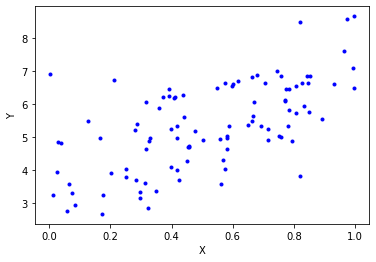


`2. Nous souhaitons entraîner le modèle en utilisant la librairie Numpy et la fonction coût`

`2.a  Calculer θ à l’aide de l’équation normal`

* On ajoute X0 = 1 sur les données


```python
X_one = np.c_[np.ones((100, 1)), X]
```

* Calcul de theta 


```python
theta = np.linalg.inv(X_one.T.dot(X_one)).dot(X_one.T).dot(Y)
```

`2.b Déduisons en le temps de calcule et les paramètres θ de ce modèle`

* Le Temps de Calcul de θ


```python
from time import time
t0 = time()
theta = np.linalg.inv(X_one.T.dot(X_one)).dot(X_one.T).dot(Y)
t1 = time()
print("Le temps de calcul de theta est : {0} secondes".format(t1-t0))
```

    Le temps de calcul de theta est : 0.0009381771087646484 secondes


* Les parametres θ de ce modele


```python
print("Les valeurs de theta sont definies comme suit :\n theta 0 = {0}\n theta 1 = {1}"
      .format(theta.item(0), theta.item(1)))
```

    Les valeurs de theta sont definies comme suit :
     theta 0 = 4.155019553056657
     theta 1 = 2.851339506947932


`2.c Interpréter les résultats obtenus`

On a : y = 4 + 3x + bruit gaussien
* On constate que les resultats obtenus ne sont pas les loins des valeurs (coefficients) 
de l'équation y ce qui prouve que le modele est pas mal. Au niveau l'équation y toujours la valeur de theta 0 est égale a 4 et au niveau du modele la valeur de theta 0 est egale à 4.155019553056657  ce qui est acceptable de meme que pour theta 1.
Cette différence entre les valeurs réelles est les valeurs de theta trouvées au niveau du model est due tout simplement à l'ajout du bruit Gaussien au niveau des données.
* Le temps de calcul est aussi acceptable (tres petite ) du fait que les dimensions de la matrice X sont raisonnables (100, 2).

`2.d Réalisons des prédictions du modèle`

* On génère de nouvelles données pour la prédiction


```python
X_new = np.array([[0], [2]])
```


```python
X_new_one = np.c_[np.ones((2, 1)), X_new]
```


```python
X_new_one
```


    array([[1., 0.],
           [1., 2.]])


* Prédiction 


```python
Y_predict = X_new_one.dot(theta)
```


```python
print("Les valeurs prédites pour les nouvelles données sont :\n {0} et {1} "
      .format(Y_predict.item(0), Y_predict.item(1)))
```

    Les valeurs prédites pour les nouvelles données sont :
     4.155019553056657 et 9.857698566952521 


`2.e Représentons graphiquement les prédicitions du modèle`


```python
plt.plot(X_new, Y_predict, "r-")
plt.plot(X, Y, "b.")
plt.axis([0, 1, 0, 8])
plt.xlabel("X")
plt.ylabel("Y")
plt.title("Représentation graphiquement des prédicitions du modèle")
plt.show()
```


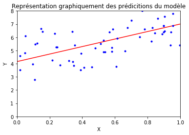


`2.f Maintenant générons des données non linéaires.`


```python
X_non_lin = 3*np.random.rand(100, 1) -5
Y_non_lin = 5 + X**3 + np.random.randn(100, 1)
```


```python
plt.plot(X_non_lin, Y_non_lin, "b.")
plt.show()
```


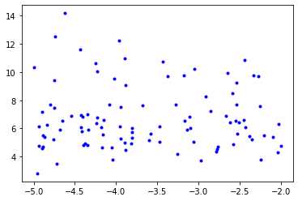


`2.i Faisons une régression linéaire`

* Calcul de theta


```python
X_one_non_lin = np.c_[np.ones((100, 1)), X_non_lin]
```


```python
theta = np.linalg.inv(X_one_non_lin.T.dot(X_one_non_lin)).dot(X_one_non_lin.T).dot(Y_non_lin)
```


```python
theta
```


    array([[ 6.45501718],
           [-0.08259185]])


`2.ii Affichons le résultat sur un graphe`


```python
X_non_lin_new = np.array([[0], [2]])
```


```python
X_non_lin_new_one = np.c_[np.ones((2, 1)), X_non_lin_new]
```


```python
Y_predict_non_lin = X_non_lin_new_one.dot(theta)
```


```python
plt.plot(X_non_lin_new, Y_predict_non_lin, "r-")
plt.plot(X_non_lin, Y_non_lin, "b.")
plt.xlabel("X")
plt.ylabel("Y")
plt.show()
```


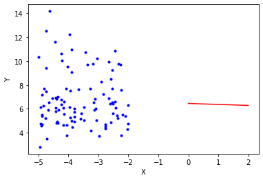


`2.iii Interprétation des résultats obtenues`

Les résulats obtenues montrent que le modéle n'est pas optimal.
Les valeurs de theta trouvées sont trés loins des valeurs qui se trouvent au niveau des données de base (5 et 3) mais aussi au niveau de la représentation graphique on constate que la droite n'est pas appropriée pour ce nuage de point.
On peut en conclure que la regréssion linéaire n'est pas un bon modéle pour simuler  nos données non linéaires.Il faut penser à d'autres modèles de machine learning.

 `3. On considère pour la suite la libraire Scikit-Learn`

`2.a Donnons le code équivalent de la régression linéaire pour le modèle
précédent.`

* Importation des modules Scikit-Learn


```python
from sklearn.linear_model import LinearRegression
```

* Entrainenment du modele


```python
lin_reg = LinearRegression()
```


```python
lin_reg.fit(X, Y)
```


    LinearRegression(copy_X=True, fit_intercept=True, n_jobs=None, normalize=False)


* Les valeurs de theta 


```python
print("La valeur de theta 0 est : {0}".format(lin_reg.intercept_[0]))
```

    La valeur de theta 0 est : 4.251807619483923


```python
print("La valeur de theta 1 est : {0}".format(lin_reg.coef_.item(0)))
```

    La valeur de theta 1 est : 2.734302928949829


* Prédiction du modele


```python
Y_predict = lin_reg.predict(X_new)
```

* Represenation Graphique


```python
plt.plot(X_new, Y_predict, "r-", label="Prediction")
plt.plot(X, Y, "b.")
plt.axis([0, 1, 0, 8])
plt.xlabel("X")
plt.ylabel("Y")
plt.title("Représentation graphiquement des prédicitions du modèle")
plt.legend()
plt.show()
```


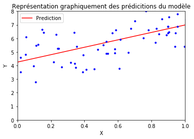


`2.b Générer un jeu de données non linéaire avec l’équation qui suit
y = 0.5x1^2 + 1.0x1 + 2.0 + bruit gaussien`

* Les données


```python
X1 = 8*np.random.rand(100, 1) - 4 
bruitGaussien = np.random.randn(100, 1)
Y1 = 0.5 * X1**2 + 1.0 * X1 + 2.0 + bruitGaussien
```

* Représentation des données


```python
plt.plot(X1, Y1, "b.")
plt.xlabel("X1")
plt.ylabel("Y1")
plt.title("Représentation des données")
plt.show()
```


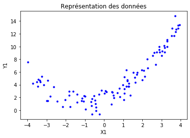


`2.c Implementons et testons sur des données aléatoires la régression polynomiale : faire une polynomialisation (tranformation des données d’apprentissage : ajout des puissances de chacune des variables comme nouvelles variables) avec PolynomialFeatures, puis entraînons un modèle linéaire sur ce nouvel ensemble de données.`

* Tranformation des données d’apprentissage : ajout des puissances de chacune des variables comme nouvelles variables


```python
from sklearn.preprocessing import PolynomialFeatures
```


```python
poly_features = PolynomialFeatures(degree=2, include_bias=False)
```


```python
X_poly = poly_features.fit_transform(X1)
```

* Entrainement du modele lineaire


```python
lin_reg.fit(X_poly, Y1)
```


    LinearRegression(copy_X=True, fit_intercept=True, n_jobs=None, normalize=False)


* Parametres du modele


```python
lin_reg.intercept_
```


    array([1.85994659])


```python
lin_reg.coef_
```


    array([[1.01947687, 0.510347  ]])


* Prédiction du modele


```python
X1_new = 8*np.random.rand(100, 1) - 4
```


```python
X1_new_poly = poly_features.fit_transform(X1_new)
```


```python
Y_predict = lin_reg.predict(X1_new_poly)
```

* Representation de la prediction


```python
plt.plot(X1_new, Y_predict, "r.", label="Prediction")
plt.plot(X1, Y1, "b.")
plt.axis([-3, 3, 0, 10])
plt.title("Representation de la prediction")
plt.legend()
plt.show()
```


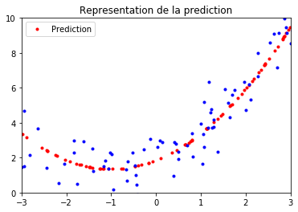


`4. Les courbes d’apprentissage sont des diagrammes représentant les résultats obtenus par le modèle sur le jeu d’entraînement et le jeu de validation en fonction de la taille du jeu d’entraînement. Pour générer ces graphiques, il suffit d’entraîner le modèle plusieurs fois sur des sous-ensembles de différentes tailles du jeu d’entraînement.`

`4.a Définissons une fonction qui trace les courbes d’apprentissage.`

* Importation des modules Scikit-Learn


```python
from sklearn.metrics import mean_squared_error
from sklearn.model_selection import train_test_split
```

* Implémentation de la fonction


```python
def plot_learning_curves(model, X, Y):
    
    #Partionnement des donnees
    X_train, X_vali, Y_train, Y_vali = train_test_split(X, Y, test_size=0.2)
    
    #Les erreurs d'entrainement et de validation
    train_errors = []
    vali_errors = []
    
    #Donnees par lots selon m
    for m in range(1, len(X_train)): 
        
        #Entrainement du modele
        model.fit(X_train[:m], Y_train[:m])
        
        #Prédictions du modele
        Y_train_predict = model.predict(X_train[:m])
        Y_vali_predict = model.predict(X_vali)
        
        # Ajout des erreurs d'entrainement et de validation apres chaque lot de donnees
        train_errors.append(mean_squared_error(Y_train[:m], Y_train_predict))
        vali_errors.append(mean_squared_error(Y_vali, Y_vali_predict))
    
    #Les courbes obtenues   
    plt.plot(np.sqrt(train_errors), "r-+", linewidth=2, label="train")
    plt.plot(np.sqrt(vali_errors), "b-", linewidth=3, label="validation")
    plt.title("Courbe d'apprentissage")
    plt.legend()
    plt.show()

```

`4.b Générons les courbes d’apprentissage pour un modèle de régression
linéaire simple et pour un modèle polynomial.`

* Modèle de Régression Linéaire 


```python
plot_learning_curves(LinearRegression(), X, Y)
```


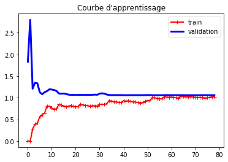


* Modèle Polynomial


```python
poly_features = PolynomialFeatures(degree=2, include_bias=False) #degree 2 (Normal)
X_poly = poly_features.fit_transform(X1)
plot_learning_curves(LinearRegression(), X_poly, Y1)
```


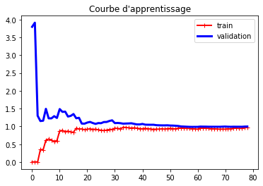


Conclusion : Model acceptable


```python
poly_features = PolynomialFeatures(degree=5, include_bias=False) #degree 5 (Anormal)
X_poly = poly_features.fit_transform(X1)
plot_learning_curves(LinearRegression(), X_poly, Y1)
```


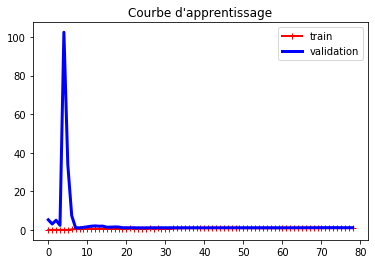


Conclusion : Sur-apprentissage du model

`5. Trouver la polynomialisation qui permet d’éviter le sur-apprentissage tout en garantissant un apprentissage s’appelle la régularisation d’un modèle. Parmi les modèles de régularisation figure la régression Ridge ou régularisation de Tikhonov, la régression LASSO (least absolute Shrinkage and Selection Operator Regression), l’Elastic Net ou le Early Stopping.
Pour chacune de ces méthodes :` 

 `5.a Rappelons l’idée générale:`

Les méthodes de régularisation ont été implémenter pour appliquer des contraintes aux parametres theta des modeles de regression d'une maniere generale. Pour opérer cette
transformation,on modifie un petit peu la fonction de coût du problème de régression en la complétant par une fonction de pénalité. Miniminiser la fonction de coût minimisera de facto les coefficients de la régression.
Un bon moyen de réduire le surajustement consiste à régulariser le modèle (lui imposer des contraintes) :moins il a de degrés de libertés, plus il est difficile de
surajuster les données.

* La régression Ridge ou régularisation de Tikhonov

La régression Ridge va utiliser une fonction de pénalité qui va diminuer la distance entre les solutions possibles, sur la base  du carre de la mesure euclidienne (le carré la norme deux).
Cela oblige l'algorithme d'apprentissage non seulement à ajuster les données, mais également à conserver les paremetres theta du model aussi petits que possible.
Le terme de régularisation α contrôle la quantité de régularisation que vous voulez imposer.Le cas α = 0 renvoie au modèle de régression linéaire simple.

* La régression LASSO (Least absolute Shrinkage and Selection Operator Regression)

La régression LASSO est presque similaire à la régression Ridge. La différence est qu' on va utiliser une fonction de pénalité qui va diminuer la distance entre les solutions possibles, sur la base de la norme 1 (distance de Manhattan).
Une caractéristique de la régression Lasso est qu’elle tend à éliminer complètement les poids des variables les moins importantes.

* L’Elastic Net ou le Early Stopping

L'Elastic Net est en fait une combinaison des deux regression précédentes (LASSO et Ridge). Le terme de régularisation est un simple mélange des termes de de régualarisation de la régression lasso et de la régression ridge.

`5.b Rappelons les fonctions de coût pour chaque régularisation`

* La régression Ridge ou régularisation de Tikhonov

<hr>
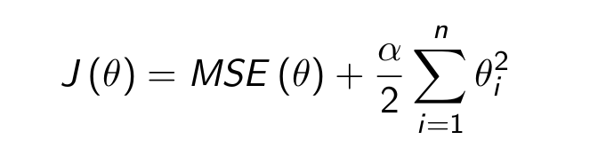
<hr>

* La régression LASSO (Least absolute Shrinkage and Selection Operator Regression)

<hr>
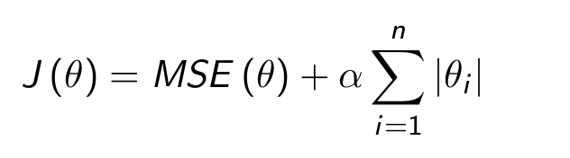
<hr>

* L’Elastic Net ou le Early Stopping

<hr>
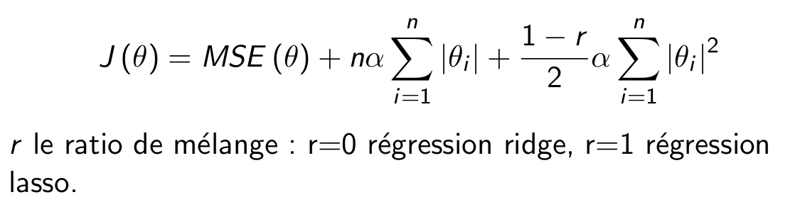
<hr>

`5.c Implémentons et testons chaque modèle.`

* La régression Ridge ou régularisation de Tikhonov


```python
from sklearn.linear_model import Ridge

ridge_reg = Ridge(alpha=1)
ridge_reg.fit(X, Y)
```


    Ridge(alpha=1, copy_X=True, fit_intercept=True, max_iter=None, normalize=False,
          random_state=None, solver='auto', tol=0.001)


```python
#Les valeurs de theta
ridge_reg.intercept_,ridge_reg.coef_
```


    (array([4.33290342]), array([[2.64691186]]))


```python
#Pediction
ridge_reg.predict([[2]])
```


    array([[9.62672713]])


* La régression LASSO (Least absolute Shrinkage and Selection Operator Regression)


```python
from sklearn.linear_model import Lasso

lasso_reg = Lasso(alpha=0.2)
lasso_reg.fit(X, Y)
```


    Lasso(alpha=0.2, copy_X=True, fit_intercept=True, max_iter=1000,
          normalize=False, positive=False, precompute=False, random_state=None,
          selection='cyclic', tol=0.0001, warm_start=False)


```python
#Les valeurs de theta
ridge_reg.intercept_,ridge_reg.coef_
```


    (array([4.33290342]), array([[2.64691186]]))


```python
#Pediction
ridge_reg.predict([[2]])
```


    array([[9.62672713]])


* L’Elastic Net ou le Early Stopping


```python
from sklearn.linear_model import ElasticNet

ela_net_reg = ElasticNet()
ela_net_reg.fit(X, Y)
```


    ElasticNet(alpha=1.0, copy_X=True, fit_intercept=True, l1_ratio=0.5,
               max_iter=1000, normalize=False, positive=False, precompute=False,
               random_state=None, selection='cyclic', tol=0.0001, warm_start=False)


```python
#Les valeurs de theta
ridge_reg.intercept_,ridge_reg.coef_
```


    (array([4.33290342]), array([[2.64691186]]))


```python
#Pediction
ridge_reg.predict([[2]])
```


    array([[9.62672713]])


<hr>
<h1  ><center id="2" style="background-color : blue; color:white">EXERCICE 2 : DESCENTE DE GRADIENT</center></h1>
<hr>

`1. Discutons sur l’impact de la dimension des pas (taux d’apprentissage) et
de la normalisation des données pour la DG.`

* Les espaces de grandes dimensions représentent un vrai problème pour les modèles de machine learning d'ou le terme "malediction de la dimension" énonce par Richard Belman. Lorsque le nombre de varibles mis en jeu est trop importante la DG a du mal à converger rapidement et le temps de calcul sera trop élevé. 
* Le facteur α, qu’on appelle le taux d'apprentissage représente physiquement la vitesse à laquelle nous souhaitons terminer nos itérations. Plus α est grand, plus le pas est grand entre deux itérations, mais plus la probabilité de passer outre le minimum, voire de diverger, est grand.On risque est de dépasser le point le plus bas et de se retrouver de l’autre côté (exploding gradient en DL).À l’inverse, plus α est petit et plus on a de chance de trouver le minimum, mais plus longue sera la convergence.L’algorithme doit effectuer un grand nombre d’itérations pour converger et prendra beaucoup de temps ou est coincé dans un min local (vanishing gradient en DL).
* La normalisation permet d'éliminer la différence d'echelle entre les différentes variables d'un dataset pour ameliorer la DG.

`2. Générons des données aléatoires X.`


```python
X = 2*np.random.rand(100, 1)
Y = 4 + 3*X + np.random.randn(100, 1)
```

`3. Normalisons les données`


```python
from sklearn.preprocessing import StandardScaler
scaler = StandardScaler()
X_norm = scaler.fit_transform(X)
```

`4. Nous considérons la descente de gradient ordinaire avec la fonction
coût d’un modèle de régression linéaire. Nous supposons que le vecteur
gradient de la fonction coût est donnée par le vecteur qui suit`

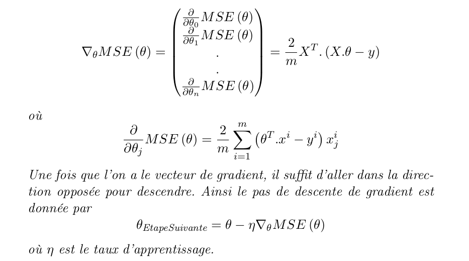

`4.a Implémentons l’algorithme de descente de gradient ordinaire avec
un nombre d’itération de l’algorithme fixé à 1000.`


```python
# taux d'apprentissage
eta = 0.1

#nombre d'iterations
n_iterations = 1000

m = 100

#initialisation aleatoire de theta
theta = np.random.randn(2,1)

X_one = np.c_[np.ones((m, 1)), X]

for iteration in range(n_iterations):
    gradients = 2/m * X_one.T.dot(X_one.dot(theta) - Y)
    theta = theta - eta * gradients
```


```python
theta
```


    array([[3.72610028],
           [3.21490439]])


`4.b En nous basant sur les graphes et les temps de calcul, interprétons les résultats obtenus avec les taux d’apprentissage suivantes :
η = 0.02, η = 0.1 et η = 0.5`

* Fonction pour calculer le temps pour chaque valeur de eta


```python
from time import time

def countTime(eta):
    t0 = time()
    n_iterations = 1000
    m = 100
    theta = np.random.randn(2,1)
    X_one = np.c_[np.ones((m, 1)), X]
    for iteration in range(n_iterations):
        gradients = 2/m * X_one.T.dot(X_one.dot(theta) - Y)
        theta = theta - eta * gradients
    t1 = time()
    return t1 - t0
```

* Fonction de Visualisation du modele aprés trois itération


```python
def visualisationGRadientDescent(eta):
    
    #nombre d'iterations
    n_iterations = 3

    m = 100

    #initialisation aleatoire de theta
    theta = np.random.randn(2,1)

    X_one = np.c_[np.ones((m, 1)), X]
    
    
    plt.plot(X, Y, "b.")


    for iteration in range(n_iterations):
        gradients = 2/m * X_one.T.dot(X_one.dot(theta) - Y)
        theta = theta - eta * gradients
        
        #Representation graphique
        X_new = np.array([[0], [2]])
        X_new_one = np.c_[np.ones((2, 1)), X_new]
        Y_predict = X_new_one.dot(theta)
        plt.plot(X_new, Y_predict, "r-")
        
        
    titre = "Pour  η = " + str(eta)
    time = "Temps : " + str(countTime(eta))
    plt.xlabel(titre)
    plt.title(time)
```

* Visualisation Globale


```python
plt.figure(figsize=(15,4))
plt.subplot(131); visualisationGRadientDescent(0.02)
plt.subplot(132); visualisationGRadientDescent(0.1)
plt.subplot(133); visualisationGRadientDescent(0.5)
plt.show()
```


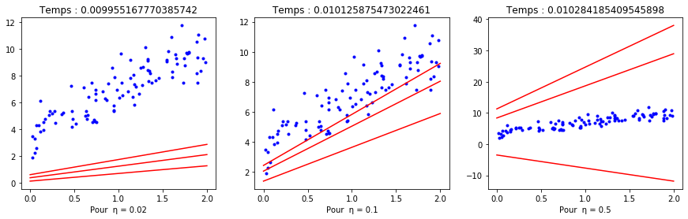


##  Interprétation des résultats

* Pour le cas n = 0.02, le taux d'apprentissage est trop trés faible : l'algorithme va éventuellement trouver une solution mais ça va prendre du temps (Voir figure).
* Pour le cas n = 0.1 , le taux d'apprentissage est acceptable : l'agotihme a convergé apres seulement trois itérations (Voir figure).
* Pour le cas n = 0.5 , le taux d'apprentissage est élevé : l'algorithme a divergé et s'eloigne de plus en plus de la solution apres seulement une seule itération (Voir figure).


`4.c En testant plusieurs nombre d’itération différentes, interprétons l’impact du nombre d’itération sur le résultat obtenu`

* Fonction de Visualisation du modele en fonction du nombre d'itération


```python
def visualisationGRadientDescent_Iteration(n_iterations):
    m = 100
    eta = 0.1
    theta = np.random.randn(2,1)
    X_one = np.c_[np.ones((m, 1)), X]
    plt.plot(X, Y, "b.")
    for iteration in range(n_iterations):
        gradients = 2/m * X_one.T.dot(X_one.dot(theta) - Y)
        theta = theta - eta * gradients
        X_new = np.array([[0], [2]])
        X_new_one = np.c_[np.ones((2, 1)), X_new]
        Y_predict = X_new_one.dot(theta)
        plt.plot(X_new, Y_predict, "r-")     
    titre = "Pour : " + str(n_iterations) + " itérations"
    plt.xlabel(titre)
```


```python
plt.figure(figsize=(15,4))
plt.subplot(131); visualisationGRadientDescent_Iteration(1)
plt.subplot(132); visualisationGRadientDescent_Iteration(5)
plt.subplot(133); visualisationGRadientDescent_Iteration(1000)
plt.show()
```


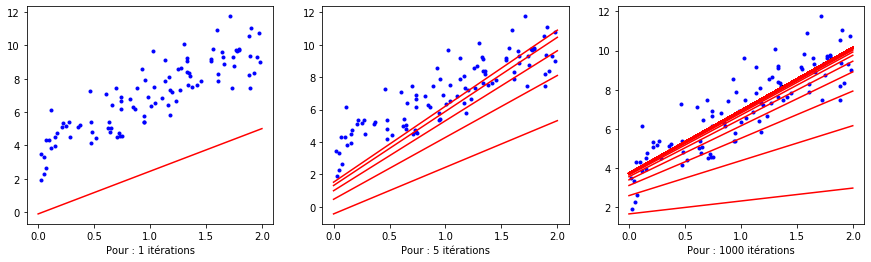


## Interprétations des resultats

* Pour un nombre petit itération (exemple une itération : Voir Figure), l'algorithme ne parvient pas a converger et est trop loin de la solution optimale. L’algorithme s’arrêtera très loin de la solution.
* Pour un nombre d'itération moyenne (exemple 5 itération : Voir Figure), l'algorithme parvient a trouver une solution mais qui peut etre ameliorée en augmentant le nombre d'itération.
* Pour un nombre d'itération trop importante (exemple 10000 itération : Voir Figure), l'algorithme converge rapidement vers une solution optimale et y reste et les paramètres du modèle ne vont plus évolués.

`4.d Modifions l’algorithme de manière à choisir un très grand nombre d’itérations, et interrompre l’algorithme lorsque le vecteur de gradient devient très petit ie quand sa norme devient inférieure à une tolérance epsilon ; ce qui signifie que la descente de gradient atteint presque son minimum`


```python
def gradientDescent(X, Y, n_iterations):
    epsilon = float("inf")
    eta = 0.1
    m = X.shape[0]
    theta = np.random.randn(2,1)
    X_one = np.c_[np.ones((m, 1)), X]
    for iteration in range(n_iterations):
        gradients = 2/m * X_one.T.dot(X_one.dot(theta) - Y)
        if (np.linalg.norm(gradients) < epsilon):
            epsilon = np.linalg.norm(gradients)
            
        theta = theta - eta * gradients
       
    return epsilon
```


```python
print("La tolérance epsilon est égale à {0}"
      .format(gradientDescent(X, Y, 1000000)))
```

    La tolérance epsilon est égale à 2.7329174293444273e-15


`4.e Rappelons les avantages et inconvénient, puis implémenter et tester
les méthodes de descente de gradient suivante`

`2.i Descente de gradient stochastique`

## Avantages et inconvénients

* La descente de gradient Stochastique, contrairement à la descente de gradient classique (Bacth) n'utilise pas tout le volume de données pour calculer le gradient à chaque iteration. Elle se base sur une instance de donnees (une seule observation)  choisie aleatoirement a chaque iteration pour calculer le gradient ce qui représente un gain de temps et d'espace. Elle est aussi plus regulière que la descente de gradient classique. Elle est plus rapide (converge vite) puisqu’il n’y a que très peu de données à manipuler à chaque itération et est facile à entraı̂ner sur des jeux de données de grande taille car il n’a besoin que d’une observation en mémoire à chaque itération,
* Le fait que les instances de donnees soient choisies de façon aléatoire fait que parfois une observations de donnée peut etre utilisée plusieurs fois tandis qu'une autre ne soit jamais utilisée ce qui peut etre presenté comme un inconvenient.

* Implémentation Avec Scikit-Learn


```python
from sklearn.linear_model import SGDRegressor
```


```python
sgd_reg = SGDRegressor(max_iter=1000, eta0=0.1, penalty="None", tol=1e-3)
```


```python
sgd_reg.fit(X, Y.ravel())
```


    SGDRegressor(alpha=0.0001, average=False, early_stopping=False, epsilon=0.1,
                 eta0=0.1, fit_intercept=True, l1_ratio=0.15,
                 learning_rate='invscaling', loss='squared_loss', max_iter=1000,
                 n_iter_no_change=5, penalty='None', power_t=0.25,
                 random_state=None, shuffle=True, tol=0.001,
                 validation_fraction=0.1, verbose=0, warm_start=False)


```python
sgd_reg.intercept_,sgd_reg.coef_
```


    (array([3.74848919]), array([3.23793414]))


* Implémentation Avec numpy


```python
n_iterations = 1000
m = X.shape[0]
X_one = np.c_[np.ones((m, 1)), X]
eta0 = 5
eta1 = 1000


# learning schedule
def learning_schedule(t):
    return eta0 / (t + eta1)

theta = np.random.randn(2,1)


for epoch in range(n_iterations):
    for i in range(m):
        random_index = np.random.randint(m)
        xi = X_one[random_index:random_index+1]
        yi = Y[random_index:random_index+1]
        gradients = 2 * xi.T.dot(xi.dot(theta) - yi)
        eta = learning_schedule(iteration * m + i)
        theta = theta - eta * gradients
```


```python
theta
```


    array([[3.43020515],
           [3.45894443]])


`2.ii. Descente de gradient par mini-lots`

## Avantages et inconvénients

* La Déscente de gradient par mini-lots, au lieu de calculer le gradient en se basant sur tout le dataset (descente de gradient classique) ou sur une instance de donnée choisie aléatoirement (descente de gradient stochastique), elle calcule le gradient sur un petit nombres d'instances choisi aléatoirement sur le dataset.Ce mecanisme permet à la Descente de gradient par mini-lots d'améliorater les performances du fait de l’optimisation matérielle des opérations matricielles.

* On peut citer comme inconvenient le fait que l'algorithme tourne autour du minimum optimale et n'est pas capable de s'arreter.


* Implémentation avec Scitkit-Learn


```python
from sklearn.linear_model import SGDRegressor
```


```python
sgdc_reg = SGDRegressor(max_iter=1000,eta0=0.1, penalty=None)
```


```python
sgdc_reg.fit(X, Y.ravel())
```


    SGDRegressor(alpha=0.0001, average=False, early_stopping=False, epsilon=0.1,
                 eta0=0.1, fit_intercept=True, l1_ratio=0.15,
                 learning_rate='invscaling', loss='squared_loss', max_iter=1000,
                 n_iter_no_change=5, penalty=None, power_t=0.25, random_state=None,
                 shuffle=True, tol=0.001, validation_fraction=0.1, verbose=0,
                 warm_start=False)


```python
sgdc_reg.intercept_,sgdc_reg.coef_
```


    (array([3.68907068]), array([3.19499508]))


* Implémentations Avec Numpy


```python
n_iterations = 1000
m = X.shape[0]
X_one = np.c_[np.ones((m, 1)), X]
eta0 = 5
eta1 = 1000
n_observations = 10


# learning schedule
def learning_schedule(t):
    return eta0 / (t + eta1)

theta = np.random.randn(2,1)


for epoch in range(n_iterations):
    for i in range(m):
        random_index = np.random.randint(m)
        xi = X_one[random_index + n_observations:random_index+1+n_observations]
        yi = Y[random_index + n_observations:random_index+1+n_observations]
        gradients = 2 * xi.T.dot(xi.dot(theta) - yi)
        eta = learning_schedule(iteration * m + i)
        theta = theta - eta * gradients
```


```python
theta
```


    array([[3.45403628],
           [3.43581797]])


## TABLEAU RECAPITULATIF DG


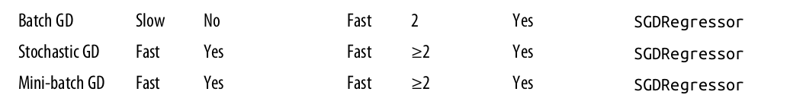

<h1  ><center style="background-color : blue; color:white">The END</center></h1>

<h1  ><center style="background-color : blue; color:white">Juillet 2020</center></h1>


```python

```
